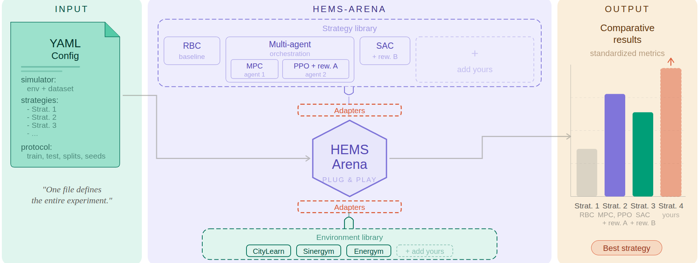
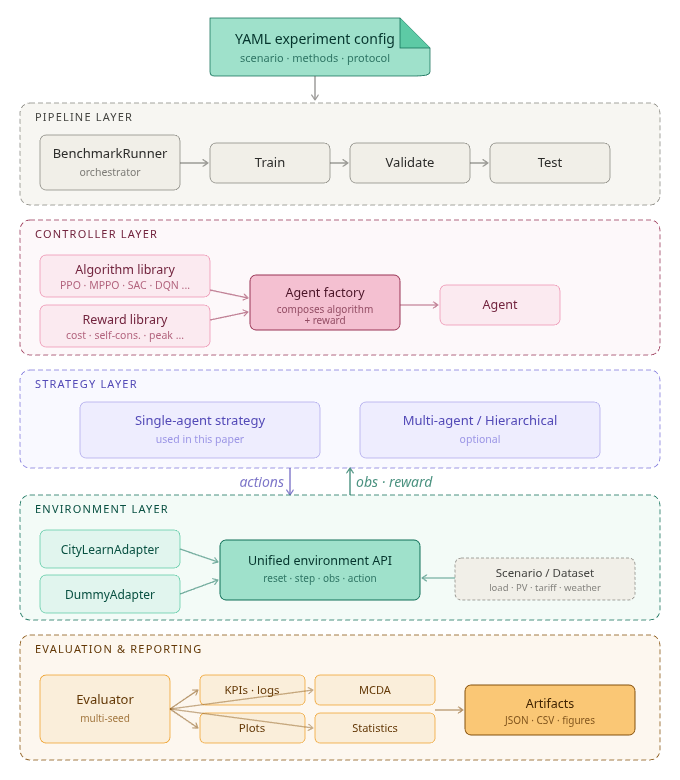
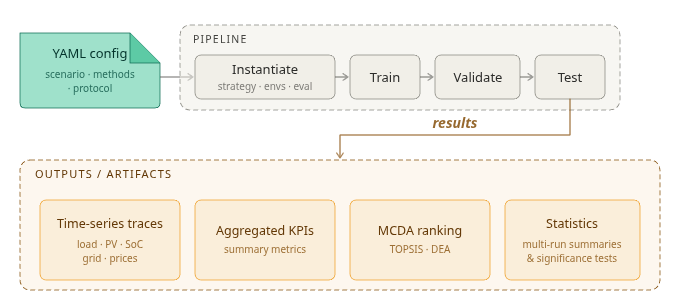

# HEMS-Arena

**An Open-Source Modular Framework for Reproducible Evaluation of Residential Energy Management Strategies**

> Damien Bouchabou & Akrem Dabbech  
> Homensia Research, France  
> EDA '26, June 22--25, 2026, Banff, Canada

HEMS-Arena is an open, contribution-oriented benchmarking platform for residential energy management. Rather than proposing another standalone simulator, it provides a shared **experimental layer** in which environments are connected through adapters, controllers are built from decoupled algorithm and reward components, strategies orchestrate one or more agents, and benchmark execution is governed by a configuration-first workflow.

**Code repository**: [github.com/Homensia/HEMS-Arena](https://github.com/Homensia/HEMS-Arena)

<p align="center">
  
</p>

*Figure 1: HEMS-Arena framework. A single YAML configuration defines the full experiment; the platform instantiates strategies from a shared library, connects them to simulation environments through adapters, and exports standardized comparative results.*

## Key Features

- **Modular architecture**: Agent = Algorithm + Reward; Strategy as orchestration wrapper; registry/factory patterns
- **Environment independence**: Adapters decouple controllers from simulator backends (CityLearn, Dummy)
- **Configuration-driven experiments**: A single YAML file defines the full benchmark protocol
- **Reproducibility**: Explicit seed management, configuration logging, artifact export
- **Reusable evaluation**: Standardized KPIs, TOPSIS/DEA multi-criteria analysis, statistical tests (Welch's t-test, Mann-Whitney U, Cohen's d)
- **Extensible**: New algorithms, rewards, strategies, and environment adapters can be added without modifying the core

## Architecture Overview

HEMS-Arena is designed not merely as a benchmark implementation for a single paper, but as an open benchmarking platform for residential HEMS research. Its core objective is to provide a shared experimental layer in which simulation environments, datasets, algorithms, rewards, agents, and strategies can be integrated as reusable benchmark assets.

### Design Goals

The architecture is guided by six core goals:

1. **(G1) Modularity** -- independently swappable components
2. **(G2) Environment independence** -- controller reuse across simulators via adapters
3. **(G3) Configuration-first experimentation** -- explicit YAML specifications
4. **(G4) Reproducibility** -- strict seed and artifact management
5. **(G5) Extensible evaluation** -- standardized KPI computation and post-analysis
6. **(G6) Community extensibility** -- external contributions without modifying the benchmark core

### Layered Experimental Stack

HEMS-Arena is organized as a layered benchmarking stack with four levels:

1. **Environment layer** -- adapters expose a unified `reset`/`step` API for heterogeneous simulators and datasets. Three adapter types bridge simulator-specific formats: observation adapters (`hems/core/adapters.py`) normalize native observations into flat vectors, action adapters convert between centralized and decentralized action modes, and reward adapters (`hems/environments/citylearn/adapters/`) extract physical signals for objective computation. Algorithms and rewards have no direct dependency on a specific backend.
2. **Controller layer** -- an **Agent** is the executable composition of an **Algorithm** (how actions are produced) and a **Reward** (what the controller is optimized for). Algorithms are defined independently of the reward specification.
3. **Strategy layer** -- a **Strategy** wraps one or more agents and defines deployment logic. The current implementation provides a `SingleAgentStrategy` where one centralized agent controls all buildings. The architecture exposes a `BaseStrategy` interface designed for future multi-agent or hierarchical extensions.
4. **Pipeline layer** -- the `BenchmarkRunner` executes standardized train/validate/test workflows from YAML specifications. Splits, budgets, seeding, and metrics are controlled by the runner and the YAML protocol, not hidden inside controller code.

```
Agent    = Algorithm + Reward
Strategy = orchestration of one or more Agents
```

<p align="center">
  
</p>

*Figure 2: HEMS-Arena as a shared experimental layer. Simulation environments are connected through adapters, control methods are composed from reusable algorithm and reward components, strategies orchestrate one or more agents, and the BenchmarkRunner executes standardized benchmark protocols.*

### Configuration-Driven Execution

Experiments are declared through a single YAML file specifying: (i) the scenario (backend, dataset, horizon), (ii) the methods (agents and optional strategy wrappers), and (iii) the protocol (train/test splits, episode budgets, random seeds, training mode). At runtime, a registry/factory mechanism resolves symbolic identifiers into concrete implementations and instantiates them with default hyperparameters that can be overridden per experiment.

This configuration-first approach makes experiments easier to reproduce and audit, and enables platform growth: new components can be plugged into the same workflow simply by being referenced in YAML, without modifying the pipeline core.

### Software Extensibility Patterns

Three design patterns play a central role: the **adapter** pattern isolates simulator-specific details, the **registry** maps YAML identifiers to concrete classes, and the **factory** composes them into executable benchmark objects. Together, they enable the addition of new components with minimal changes to the core platform.

### Reproducibility and Traceability

Reproducibility is built into the architecture through explicit seed management across Python, NumPy, and PyTorch (CPU/CUDA), with deterministic CUDNN mode enabled at the start of each experiment (`hems/utils/seed_manager.py`). A configuration summary and benchmark results are saved alongside experiment outputs for traceability.

## Implemented Methods

| Method | Type | Description |
|---|---|---|
| No-control (baseline) | Baseline | No active battery scheduling |
| RBC | Heuristic | Tariff-aware rule-based charging/discharging |
| MPC-forecast | Optimization | Forecasting-based MPC from CityLearn Challenge 2022 |
| DQN | RL | Deep Q-Network |
| SAC | RL | Soft Actor-Critic |
| CB-DQN | RL | Chen-Bu-inspired DQN adapted for residential battery control |
| MP-PPO | RL (exploratory) | Multi-policy PPO variant |

## Installation

### Prerequisites

- Python 3.9+
- (Optional) NVIDIA GPU with CUDA for accelerated training

### Setup

```bash
git clone https://github.com/Homensia/HEMS-Arena.git
cd HEMS-Arena

python -m venv hems_env
source hems_env/bin/activate  # Linux/Mac
# hems_env\Scripts\activate   # Windows

pip install -r requirements.txt
```

### What's Included

The repository ships with everything needed to run experiments:

| Directory | Content | Size |
|---|---|---|
| `datasets/citylearn_datasets/` | CityLearn Challenge 2022 dataset (17 buildings, 8760 hourly timesteps) | ~13 MB |
| `datasets/demo_1/` | Lightweight demo dataset for quick tests | ~4 MB |
| `data/external/` | Precomputed baselines (DP policy, carbon intensity, pricing) | ~15 MB |
| `synthetic_data/` | Synthetic dataset generator (load, PV, tariffs) | scripts only |
| `benchmark_configs/` | YAML experiment configurations including Scenario S1 | configs only |
| `models_pretrain/` | MP-PPO pretraining script | script only |

No additional downloads are required to reproduce the core paper results (No-control, RBC, MPC-forecast, DQN, SAC, CB-DQN).

> **MP-PPO pretraining**: The MP-PPO algorithm requires a pretrained predictor model. To generate it, run the pretraining script before launching MP-PPO experiments:
> ```bash
> python models_pretrain/pretrain_mp_ppo.py
> ```
> This produces model weights in `models/` which are excluded from the repository due to their binary nature.

> **AmbitiousEngineers**: The `data/models/` directory (~408 MB) is also excluded. Contact the authors for access to pretrained AmbitiousEngineers weights.

## Quick Start

```bash
# Single building, 7 days, compare 3 algorithms
python -m hems.main --buildings 1 --days 7 --agents baseline rbc dqn --gpu

# Run with a YAML benchmark config
python -m hems.main --benchmark-config benchmark_configs/example_sequential.yaml

# Quick test with the dummy environment (no CityLearn dependency)
python -m hems.main --buildings 1 --days 7 --agents baseline rbc --environment dummy
```

## Reproducing Paper Results (Scenario S1)

<p align="center">
  
</p>

*Figure 3: Configuration-driven benchmark workflow. A single YAML specification defines the scenario, methods, and protocol; the pipeline then instantiates the corresponding components, executes the train/validate/test stages, and exports standardized artifacts including time-series traces, aggregated KPIs, MCDA rankings, and statistical summaries.*

The reference benchmark from the paper is fully specified in [`benchmark_configs/scenario_s1.yaml`](benchmark_configs/scenario_s1.yaml).

### Scenario S1 Parameters

| Parameter | Value |
|---|---|
| Dataset | CityLearn Challenge 2022 (`citylearn_challenge_2022_phase_all`) |
| Buildings | 17 residential single-family buildings |
| Training set | Buildings 1--10 |
| Test set | Buildings 11--17 |
| Tariff | French TOU (HP: 0.22 EUR/kWh, HC: 0.14 EUR/kWh) |
| Horizon | Full year (8760 hourly timesteps) |
| Training episodes | 100 per method |
| Base seed | 42 |
| Methods | No-control, RBC, MPC-forecast, DQN, SAC, CB-DQN |

### Single run

```bash
python -m hems.main --benchmark-config benchmark_configs/scenario_s1.yaml
```

### Repeated-run evaluation (100 independent runs)

The paper reports mean +/- std over 100 independent end-to-end runs with different seeds. To reproduce:

```bash
for seed in $(seq 1 100); do
  python -m hems.main --benchmark-config benchmark_configs/scenario_s1.yaml --seed $seed --output-dir results/scenario_s1_seed_${seed}
done
```

> **Compute budget**: Each method takes approximately 8--25 hours on a Dell G16 7630 (Intel i9-13900HX, NVIDIA RTX 4070, 32 GB RAM). The full 100-run benchmark requires significant compute resources.

### Reference Results (Scenario S1)

The following tables summarize the results reported in the paper. For learning-based methods, values are mean +/- std over 100 independent end-to-end runs.

#### Core KPIs

| Method | Cost (EUR/year) | Delta | SC (%) | Cycles | Peak (kW) |
|---|---|---|---|---|---|
| No-control | 1245.3 +/- 0.0 | -- | 42.1 | 0.0 | 7.21 |
| RBC | 1087.5 +/- 0.0 | -12.7% | 58.3 | 142.5 | 6.84 |
| MPC-forecast | 1024.8 +/- 0.0 | -17.7% | 64.7 | 178.3 | 6.74 |
| DQN | 1012.3 +/- 18.7 | -18.7% | 67.2 | 165.8 | 6.67 |
| SAC | 1005.2 +/- 15.2 | -19.3% | 68.9 | 162.1 | 6.68 |
| CB-DQN | 998.7 +/- 14.1 | -19.8% | 69.8 | 159.3 | 6.61 |

*Cost = annual total electricity cost. Delta = relative to No-control. SC = PV self-consumption. Cycles = battery cycles. Peak = peak demand.*

#### Multi-Criteria Analysis (TOPSIS & DEA)

| Method | TOPSIS C_i | TOPSIS Rank | DEA q* | DEA Rank |
|---|---|---|---|---|
| CB-DQN | 0.795 | 1 | 1.000 | 1 (tied) |
| SAC | 0.749 | 2 | 1.000 | 1 (tied) |
| DQN | 0.691 | 3 | 0.945 | 3 |
| MPC-forecast | 0.603 | 4 | 0.823 | 4 |
| RBC | 0.321 | 5 | 0.378 | 5 |
| No-control | 0.052 | 6 | 0.142 | 6 |

Spearman rank correlation between TOPSIS and DEA: rho = 0.964, p < 0.001.

### Expected outputs

Results are saved to `experiments/scenario_s1/` (or `results/scenario_s1_seed_N/` for repeated runs) and include:

- **Time-series traces**: Per-timestep load, PV, SoC, actions, cost
- **Aggregated KPIs**: Annual electricity cost (EUR/year), PV self-consumption (%), battery cycles, peak demand (kW)
- **MCDA rankings**: TOPSIS and DEA multi-criteria analysis
- **Statistical tests**: Welch's t-test, Mann-Whitney U, Cohen's d with 95% confidence intervals
- **Plots**: Training curves, performance comparisons, battery SoC trajectories

## Project Structure

```
HEMS-Arena/
├── hems/                        # Main Python package
│   ├── main.py                  # CLI entry point
│   ├── algorithms/              # Algorithm implementations (DQN, SAC, RBC, ...)
│   ├── rewards/                 # Reward functions (custom_v5, Chen_Bu_p2p, ...)
│   ├── strategies/              # Deployment strategies (single-agent)
│   ├── agents/                  # Agent composition and factory
│   ├── environments/            # Environment adapters (CityLearn, Dummy)
│   ├── core/                    # Runner, config, training, evaluation, persistence
│   ├── wrappers/                # Stable-Baselines3 integration
│   ├── analysis/                # Exploratory data analysis
│   └── visualization/           # Plotting (matplotlib, Plotly)
├── datasets/                    # CityLearn datasets (included)
├── data/external/               # Precomputed baselines (included)
├── models/                      # Pretrained model weights (generated locally)
├── synthetic_data/              # Synthetic dataset generator
├── benchmark_configs/           # YAML experiment configs (including scenario_s1.yaml)
├── tests/                       # Test suite
├── scripts/                     # Standalone diagnostic utilities
├── requirements.txt             # Python dependencies
└── pyproject.toml               # Package metadata
```

## CLI Reference

```
python -m hems.main [OPTIONS]
```

| Flag | Description |
|---|---|
| `--buildings N` | Number of buildings (1--15) |
| `--days N` | Simulation days (1--365) |
| `--building-id ID` | Specific building (e.g., `Building_1`) |
| `--agents [names]` | Agents to evaluate: `baseline`, `rbc`, `tql`, `sac`, `dqn`, `mp_ppo`, `mpc_forecast`, `ambitious_engineers`, `Chen_Bu_p2p` |
| `--tariff TYPE` | `default`, `hp_hc`, `tempo`, `standard` |
| `--environment TYPE` | `citylearn`, `dummy`, `synthetic` |
| `--train-episodes N` | Training episodes for RL agents |
| `--gpu` | Use GPU if available |
| `--benchmark-config PATH` | Run from YAML config file |
| `--seed N` | Random seed (default: 42) |
| `--output-dir DIR` | Output directory (default: `results`) |
| `--eda` | Perform exploratory data analysis |

## Running Tests

```bash
# All tests
pytest tests/ -v

# Single test
pytest tests/test_mp_ppo.py -v
```

## Citation

If you use HEMS-Arena in your research, please cite the corresponding paper upon publication.

```bibtex
@inproceedings{bouchabou2026hemsarena,
  title     = {{HEMS-Arena}: An Open-Source Modular Framework for Reproducible
               Evaluation of Residential Energy Management Strategies},
  author    = {Bouchabou, Damien and Dabbech, Akrem},
  booktitle = {Proceedings of EDA '26},
  year      = {2026},
  address   = {Banff, Canada},
  url       = {https://github.com/Homensia/HEMS-Arena}
}
```

## License

This project is licensed under the [Business Source License 1.1](LICENSE) (BSL 1.1). You are free to use, modify, and contribute to this code for non-commercial purposes (research, education, personal use). Commercial use requires a separate license from Homensia. After April 7, 2036, the code will be available under the Apache License 2.0.

See the [LICENSE](LICENSE) file for full details.

## Acknowledgments

- [CityLearn](https://github.com/intelligent-environments-lab/CityLearn) -- Building simulation environment
- [Stable-Baselines3](https://github.com/DLR-RM/stable-baselines3) -- RL algorithm implementations
- [PyTorch](https://pytorch.org/) -- Deep learning framework
